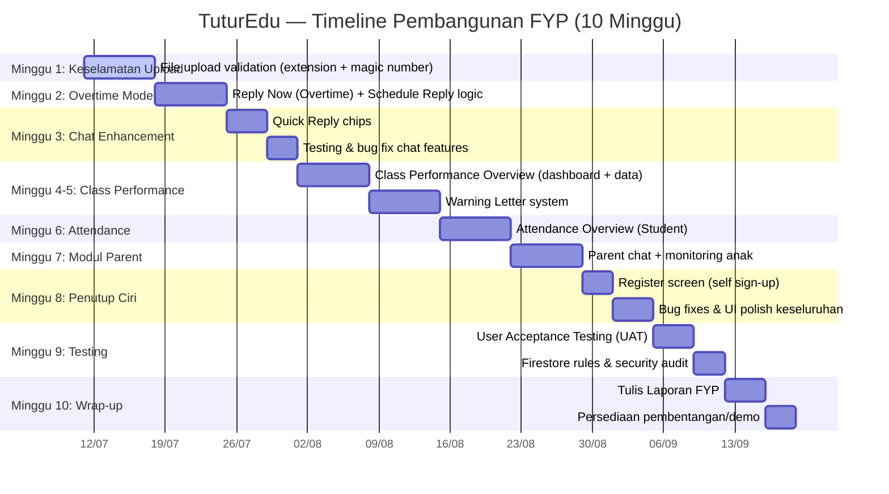

```mermaid 
gantt

    title TuturEdu — Timeline Pembangunan FYP (10 Minggu)
    dateFormat YYYY-MM-DD
    axisFormat %d/%m
    todayMarker on
 
    section Minggu 1: Keselamatan Upload
    File upload validation (extension + magic number)   :active,a1, 2026-07-11, 7d
 
    section Minggu 2: Overtime Mode
    Reply Now (Overtime) + Schedule Reply logic          :a2, after a1, 7d
 
    section Minggu 3: Chat Enhancement
    Quick Reply chips                                    :b1, after a2, 4d
    Testing & bug fix chat features                      :b2, after b1, 3d
 
    section Minggu 4-5: Class Performance
    Class Performance Overview (dashboard + data)        :c1, after b2, 7d
    Warning Letter system                                :c2, after c1, 7d
 
    section Minggu 6: Attendance
    Attendance Overview (Student)                        :d1, after c2, 7d
 
    section Minggu 7: Modul Parent
    Parent chat + monitoring anak                        :e1, after d1, 7d
 
    section Minggu 8: Penutup Ciri
    Register screen (self sign-up)                       :f1, after e1, 3d
    Bug fixes & UI polish keseluruhan                    :f2, after f1, 4d
 
    section Minggu 9: Testing
    User Acceptance Testing (UAT)                        :g1, after f2, 4d
    Firestore rules & security audit                     :g2, after g1, 3d
 
    section Minggu 10: Wrap-up
    Tulis Laporan FYP                                    :h1, after g2, 4d
    Persediaan pembentangan/demo                         :h2, after h1, 3d

```